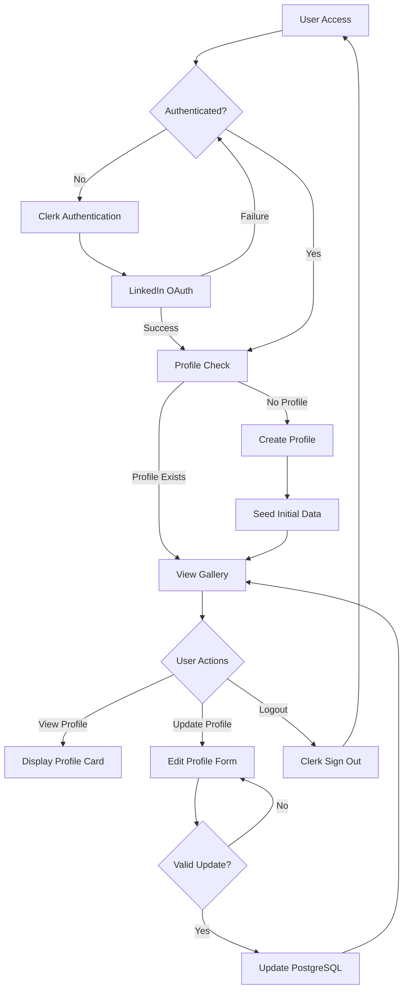
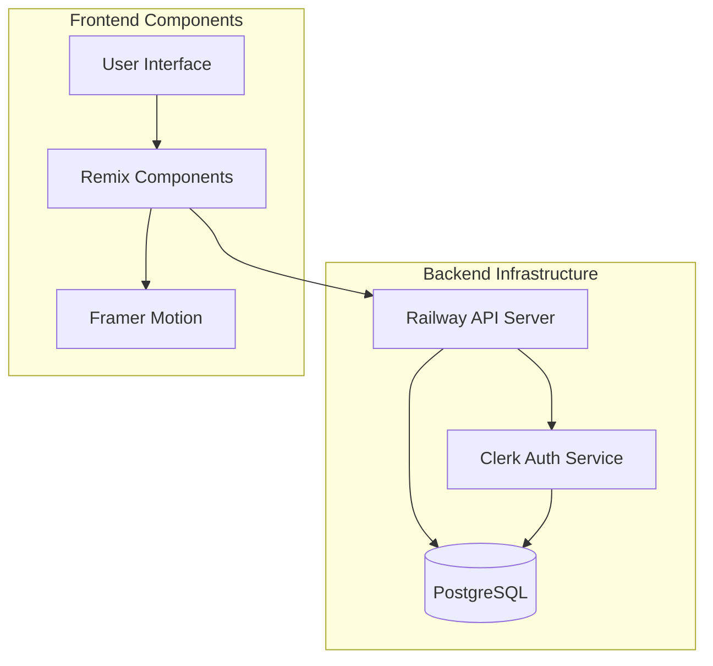
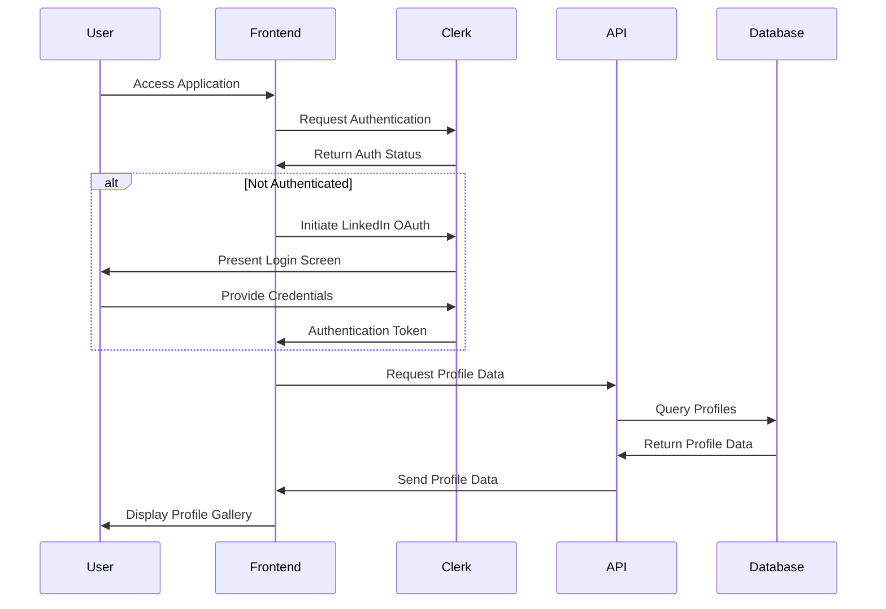
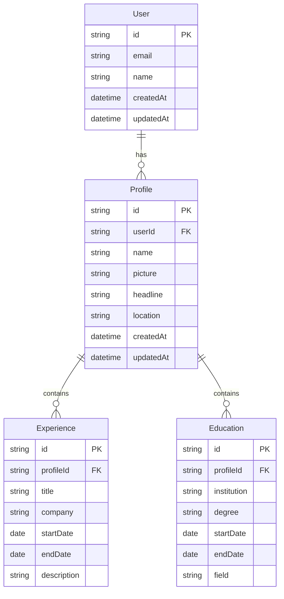
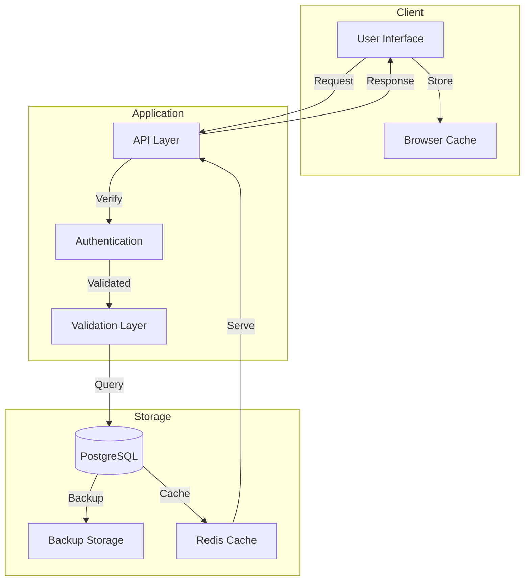
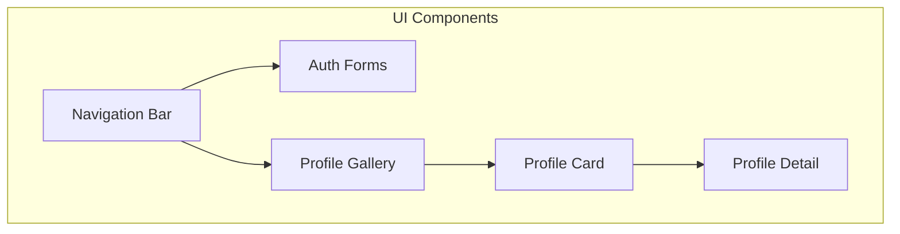
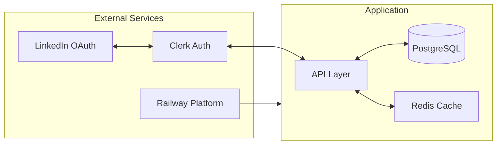

# Product Requirements Document (PRD)

# 1. INTRODUCTION

## 1.1 Purpose
This Product Requirements Document (PRD) outlines the comprehensive specifications for developing a dynamic LinkedIn profile gallery application using Remix, Railway, and PostgreSQL. The document serves as a reference for developers, project managers, and stakeholders involved in the development and deployment process. It provides detailed technical requirements, functional specifications, and implementation guidelines.

## 1.2 Scope
The LinkedIn Profiles Gallery application is a web-based platform that showcases user profiles with animated card interfaces. The system encompasses:

- User authentication through Clerk with LinkedIn OAuth integration
- PostgreSQL database integration for profile storage and management
- Responsive profile gallery with Framer Motion animations
- Automated profile seeding functionality
- Railway-based deployment infrastructure

Key features include:
- Secure user authentication and authorization
- Dynamic profile card displays with 3D hover effects
- Scalable database architecture
- Automated deployment pipeline
- Real-time profile data management

The application aims to provide:
- Seamless user experience for profile browsing
- Secure and efficient data storage
- High performance and reliability
- Easy maintenance and scalability
- Modern, responsive design interface

# 2. PRODUCT DESCRIPTION

## 2.1 Product Perspective
The LinkedIn Profiles Gallery application operates as a standalone web application while integrating with several external systems and services:

- **Authentication Layer**: Integrates with Clerk authentication service and LinkedIn OAuth for secure user management
- **Database Infrastructure**: Utilizes Railway-hosted PostgreSQL database for profile data storage
- **Frontend Framework**: Built on Remix framework, providing server-side rendering capabilities
- **Deployment Platform**: Hosted on Railway's cloud infrastructure
- **Animation System**: Leverages Framer Motion for interactive user interface elements

## 2.2 Product Functions
The system provides the following core functions:

- User authentication and authorization via Clerk
- Profile data management and storage
- Dynamic profile gallery display with 3D animations
- Automated profile seeding for new users
- Responsive layout adaptation across devices
- Real-time profile data updates
- Secure data access and modification

## 2.3 User Characteristics
The application targets three primary user groups:

1. **Professional Networkers**
   - Technical proficiency: Intermediate
   - Usage frequency: Daily
   - Primary need: Profile discovery and management

2. **Recruitment Professionals**
   - Technical proficiency: Basic to Intermediate
   - Usage frequency: High
   - Primary need: Candidate browsing and tracking

3. **System Administrators**
   - Technical proficiency: Advanced
   - Usage frequency: As needed
   - Primary need: System maintenance and user management

## 2.4 Constraints

### 2.4.1 Technical Constraints
- Must use Remix framework for development
- PostgreSQL database requirement
- Railway deployment platform limitation
- Clerk authentication service dependency
- Browser compatibility requirements (modern browsers only)

### 2.4.2 Regulatory Constraints
- GDPR compliance for user data handling
- Data privacy regulations compliance
- OAuth 2.0 protocol adherence
- Secure data transmission requirements

### 2.4.3 Resource Constraints
- Railway free tier limitations
- Database storage capacity limits
- API rate limiting considerations
- Development timeline restrictions

## 2.5 Assumptions and Dependencies

### 2.5.1 Assumptions
- Users have modern web browsers
- Stable internet connection availability
- LinkedIn API continues to support OAuth integration
- Railway maintains current service levels
- Users accept third-party authentication

### 2.5.2 Dependencies
- Clerk authentication service availability
- Railway platform uptime
- PostgreSQL database service
- LinkedIn OAuth service
- NPM package availability
- GitHub repository access
- Framer Motion library support

# 3. PROCESS FLOWCHART







# 4. FUNCTIONAL REQUIREMENTS

## 4.1 Authentication System (F1)

### Description
Secure user authentication and authorization using Clerk with LinkedIn OAuth integration.

### Priority
High

### Requirements

| ID    | Requirement | Description | Acceptance Criteria |
|-------|-------------|-------------|-------------------|
| F1.1  | LinkedIn OAuth Integration | Enable users to sign in using LinkedIn credentials | - Successful OAuth flow with LinkedIn<br>- Proper error handling<br>- Redirect to profile page after auth |
| F1.2  | Session Management | Maintain secure user sessions | - JWT token implementation<br>- Session timeout after 24 hours<br>- Secure cookie handling |
| F1.3  | Authorization Controls | Implement role-based access control | - Admin/User role distinction<br>- Protected route handling<br>- Permission validation |

## 4.2 Profile Management (F2)

### Description
Core profile data management functionality including creation, retrieval, and updates.

### Priority
High

### Requirements

| ID    | Requirement | Description | Acceptance Criteria |
|-------|-------------|-------------|-------------------|
| F2.1  | Profile Creation | Automatic profile generation on first login | - Data extraction from LinkedIn<br>- Default avatar assignment<br>- Required field validation |
| F2.2  | Profile Updates | Allow users to modify their profile information | - Real-time validation<br>- Image upload support<br>- Change history tracking |
| F2.3  | Profile Deletion | Enable users to remove their profiles | - Soft delete implementation<br>- Data backup before deletion<br>- Cascade deletion handling |

## 4.3 Gallery Interface (F3)

### Description
Interactive profile gallery with Framer Motion animations and responsive design.

### Priority
Medium

### Requirements

| ID    | Requirement | Description | Acceptance Criteria |
|-------|-------------|-------------|-------------------|
| F3.1  | Gallery Layout | Responsive grid layout for profile cards | - 3-column desktop layout<br>- 2-column tablet layout<br>- Single column mobile layout |
| F3.2  | Animation Effects | Implement 3D hover and transition effects | - Smooth rotation animations<br>- Scale transitions<br>- Performance optimization |
| F3.3  | Profile Card Design | Standardized card layout for profile display | - Consistent spacing<br>- Image optimization<br>- Loading state handling |

## 4.4 Data Management (F4)

### Description
PostgreSQL database operations and data seeding functionality.

### Priority
High

### Requirements

| ID    | Requirement | Description | Acceptance Criteria |
|-------|-------------|-------------|-------------------|
| F4.1  | Database Operations | CRUD operations for profile data | - Prepared statements<br>- Transaction handling<br>- Error recovery |
| F4.2  | Data Seeding | Automated profile seeding for new users | - 30 default profiles<br>- Unique data generation<br>- Seed verification |
| F4.3  | Data Validation | Input validation and sanitization | - XSS prevention<br>- Type checking<br>- Format validation |

## 4.5 Deployment System (F5)

### Description
Railway-based deployment and infrastructure management.

### Priority
Medium

### Requirements

| ID    | Requirement | Description | Acceptance Criteria |
|-------|-------------|-------------|-------------------|
| F5.1  | Automated Deployment | CI/CD pipeline setup | - GitHub integration<br>- Automated testing<br>- Rollback capability |
| F5.2  | Environment Management | Configuration for different environments | - Development/Production separation<br>- Environment variable handling<br>- Secret management |
| F5.3  | Performance Monitoring | System health and performance tracking | - Error logging<br>- Performance metrics<br>- Uptime monitoring |

# 5. NON-FUNCTIONAL REQUIREMENTS

## 5.1 Performance Requirements

| Metric | Requirement | Target |
|--------|-------------|---------|
| Page Load Time | Initial page load time | < 2 seconds |
| Time to Interactive | Time until user can interact with profile cards | < 3 seconds |
| Animation Performance | Frame rate for Framer Motion animations | 60 fps minimum |
| Database Query Time | Maximum response time for profile queries | < 100ms |
| API Response Time | Maximum time for API endpoint responses | < 200ms |
| Concurrent Users | Number of simultaneous users supported | 1000 minimum |
| Resource Usage | Maximum memory usage per instance | < 512MB |

## 5.2 Safety Requirements

| Category | Requirement | Implementation |
|----------|-------------|----------------|
| Data Backup | Automated daily backups of PostgreSQL database | Railway automated backup service |
| Failure Recovery | System recovery time after failure | < 5 minutes |
| Data Loss Prevention | Maximum acceptable data loss window | < 24 hours |
| Error Handling | Graceful degradation of functionality | Fallback UI components |
| State Management | Prevention of data corruption during failures | Transaction rollback mechanisms |
| Service Redundancy | Failover capability for critical services | Railway multi-region deployment |

## 5.3 Security Requirements

| Feature | Requirement | Specification |
|---------|-------------|---------------|
| Authentication | Multi-factor authentication support | Clerk MFA implementation |
| Authorization | Role-based access control | User/Admin permission levels |
| Data Encryption | Data at rest and in transit | AES-256 encryption, TLS 1.3 |
| Session Management | Secure session handling | JWT with 24-hour expiration |
| Input Validation | Prevention of injection attacks | Server-side validation, prepared statements |
| API Security | Rate limiting and request validation | 100 requests per minute per IP |
| Data Privacy | GDPR compliance measures | Data minimization, consent management |

## 5.4 Quality Requirements

### 5.4.1 Availability
- System uptime: 99.9%
- Planned maintenance windows: < 4 hours monthly
- Maximum unplanned downtime: 1 hour per month

### 5.4.2 Maintainability
- Code documentation coverage: > 80%
- Module coupling score: < 0.4
- Test coverage: > 85%
- Time to implement minor changes: < 4 hours

### 5.4.3 Usability
- Mobile responsiveness: 100% compatibility
- Accessibility compliance: WCAG 2.1 Level AA
- Maximum user error rate: < 1%
- User task completion rate: > 95%

### 5.4.4 Scalability
- Horizontal scaling capability: Up to 10 instances
- Database connection pool: 100 connections per instance
- Storage scalability: Up to 1TB
- API scalability: 1M requests per day

### 5.4.5 Reliability
- Mean Time Between Failures (MTBF): > 720 hours
- Mean Time To Recovery (MTTR): < 30 minutes
- Error rate: < 0.1% of all requests
- Data consistency: 99.99%

## 5.5 Compliance Requirements

| Requirement | Standard | Implementation |
|-------------|----------|----------------|
| Data Protection | GDPR | User consent management, data portability |
| Authentication | OAuth 2.0 | LinkedIn OAuth implementation |
| API Standards | REST | RESTful API design principles |
| Security | OWASP Top 10 | Security controls and testing |
| Accessibility | WCAG 2.1 | Semantic HTML, ARIA labels |
| Browser Support | Modern Browsers | Chrome 90+, Firefox 88+, Safari 14+ |
| Code Quality | ESLint | Airbnb style guide compliance |

# 6. DATA REQUIREMENTS

## 6.1 Data Models

### 6.1.1 Entity Relationship Diagram



## 6.2 Data Storage

### 6.2.1 Database Configuration

| Parameter | Value | Description |
|-----------|-------|-------------|
| Database Type | PostgreSQL 14+ | Primary data store |
| Connection Pool | 20 connections | Per application instance |
| Max Pool Size | 50 connections | Global maximum |
| Idle Timeout | 10 minutes | Connection recycling |
| Storage Engine | PostgreSQL MVCC | Concurrent access handling |

### 6.2.2 Data Retention

| Data Type | Retention Period | Storage Location |
|-----------|-----------------|------------------|
| User Profiles | Indefinite | Primary Database |
| Deleted Profiles | 30 days | Archive Database |
| Session Data | 24 hours | Redis Cache |
| Audit Logs | 90 days | Log Storage |
| Backup Data | 30 days | Railway Backup Storage |

### 6.2.3 Backup Strategy

| Backup Type | Frequency | Retention | Method |
|-------------|-----------|-----------|---------|
| Full Backup | Daily | 7 days | Railway Automated Backup |
| Incremental | Hourly | 24 hours | WAL Archiving |
| Point-in-Time | Continuous | 72 hours | Transaction Logs |

## 6.3 Data Processing

### 6.3.1 Data Flow Diagram



### 6.3.2 Data Security Controls

| Security Layer | Implementation | Purpose |
|----------------|----------------|----------|
| Transport | TLS 1.3 | Data in transit |
| Storage | AES-256 | Data at rest |
| Access Control | Row-Level Security | Data isolation |
| Audit | Change Data Capture | Activity tracking |
| Encryption | Column-Level | PII protection |

### 6.3.3 Data Validation Rules

| Field | Validation Rule | Error Handling |
|-------|----------------|----------------|
| Email | RFC 5322 | Return 400 Bad Request |
| Name | 2-50 chars | Return 400 Bad Request |
| Picture URL | Valid HTTPS URL | Use default avatar |
| LinkedIn ID | OAuth verified | Redirect to auth |
| Profile Data | JSON Schema | Return validation errors |

# 7. EXTERNAL INTERFACES

## 7.1 User Interfaces

### 7.1.1 Layout Requirements

| Screen | Layout Requirements | Responsive Breakpoints |
|--------|-------------------|----------------------|
| Profile Gallery | 3-column grid (desktop) | Desktop: ≥1024px |
| | 2-column grid (tablet) | Tablet: ≥768px |
| | Single column (mobile) | Mobile: <768px |
| Authentication | Centered form layout | All breakpoints |
| Profile Detail | Two-panel layout | ≥768px |
| | Single panel stacked | <768px |

### 7.1.2 Component Specifications



### 7.1.3 Interface Elements

| Element | Interaction | Animation |
|---------|------------|-----------|
| Profile Card | Hover effect | 3D rotation with Framer Motion |
| Navigation | Sticky positioning | Smooth scroll transitions |
| Form Inputs | Real-time validation | Validation state animations |
| Loading States | Skeleton loading | Fade-in transitions |
| Error Messages | Toast notifications | Slide-in animations |

## 7.2 Software Interfaces

### 7.2.1 External Services Integration

| Service | Interface Type | Purpose |
|---------|---------------|----------|
| Clerk | REST API | Authentication and user management |
| LinkedIn OAuth | OAuth 2.0 | User authentication |
| PostgreSQL | Database Driver | Data persistence |
| Railway | Platform API | Deployment and infrastructure |

### 7.2.2 API Specifications

| Endpoint | Method | Request Format | Response Format |
|----------|--------|----------------|-----------------|
| /api/profiles | GET | N/A | JSON Array |
| /api/profiles/:id | GET | URL Param | JSON Object |
| /api/profiles | POST | JSON | JSON Object |
| /api/profiles/:id | PUT | JSON | JSON Object |
| /api/auth/* | ALL | Managed by Clerk | JWT Token |

## 7.3 Communication Interfaces

### 7.3.1 Network Protocols

| Protocol | Usage | Configuration |
|----------|-------|---------------|
| HTTPS | All client-server communication | TLS 1.3 |
| WebSocket | Real-time updates | Railway WebSocket service |
| HTTP/2 | API requests | Railway load balancer |

### 7.3.2 Data Exchange Formats

| Format | Usage | Schema Location |
|--------|-------|----------------|
| JSON | API responses | /app/types/api.ts |
| JWT | Authentication tokens | Clerk managed |
| Base64 | Image encoding | Profile pictures |

### 7.3.3 Integration Points



# 8. APPENDICES

## 8.1 GLOSSARY

| Term | Definition |
|------|------------|
| Railway | A modern application deployment platform that provides infrastructure and deployment services |
| Clerk | A complete authentication and user management solution |
| Framer Motion | A production-ready motion library for React applications |
| OAuth | An open standard for access delegation and authorization |
| JWT | JSON Web Token, a compact URL-safe means of representing claims between parties |
| MVCC | Multi-Version Concurrency Control, PostgreSQL's method for handling concurrent database access |
| WAL | Write-Ahead Logging, a standard method for ensuring data integrity |

## 8.2 ACRONYMS

| Acronym | Expansion |
|---------|-----------|
| API | Application Programming Interface |
| CRUD | Create, Read, Update, Delete |
| GDPR | General Data Protection Regulation |
| JWT | JSON Web Token |
| MFA | Multi-Factor Authentication |
| MTBF | Mean Time Between Failures |
| MTTR | Mean Time To Recovery |
| OAuth | Open Authorization |
| PII | Personally Identifiable Information |
| REST | Representational State Transfer |
| TLS | Transport Layer Security |
| UI | User Interface |
| URL | Uniform Resource Locator |
| WCAG | Web Content Accessibility Guidelines |
| XSS | Cross-Site Scripting |

## 8.3 ADDITIONAL REFERENCES

### 8.3.1 Technical Documentation

| Resource | URL | Purpose |
|----------|-----|---------|
| Remix Documentation | https://remix.run/docs | Framework reference |
| Railway Documentation | https://docs.railway.app | Deployment platform guide |
| Clerk Documentation | https://clerk.dev/docs | Authentication implementation |
| Framer Motion API | https://www.framer.com/motion | Animation reference |
| PostgreSQL Manual | https://www.postgresql.org/docs | Database management |

### 8.3.2 Development Tools

| Tool | Purpose | URL |
|------|---------|-----|
| Prisma Studio | Database management interface | https://www.prisma.io/studio |
| Railway CLI | Command-line deployment tool | https://docs.railway.app/cli/installation |
| ESLint Config | Code style enforcement | https://eslint.org/docs/latest |
| Tailwind CSS | Utility-first CSS framework | https://tailwindcss.com/docs |

### 8.3.3 Security Standards

| Standard | Description | Reference |
|----------|-------------|-----------|
| OWASP Top 10 | Web application security risks | https://owasp.org/Top10 |
| OAuth 2.0 | Authorization framework | https://oauth.net/2 |
| GDPR Guidelines | Data protection compliance | https://gdpr.eu/guidelines |

## 8.4 DEVELOPMENT ENVIRONMENT SETUP

```bash
# Initial setup
npx create-remix@latest linkedin-profiles-app
cd linkedin-profiles-app

# Dependencies installation
npm install @clerk/remix @clerk/clerk-sdk-node
npm install framer-motion @prisma/client remix-auth
npm install -D prisma

# Database initialization
npx prisma init
npx prisma db push
npx prisma db seed

# Environment configuration
cp .env.example .env
```

## 8.5 DEPLOYMENT CHECKLIST

| Task | Description | Verification |
|------|-------------|-------------|
| Environment Variables | Configure all required env vars | Check Railway dashboard |
| Database Migration | Run latest migrations | Check Prisma migration status |
| Build Verification | Test production build locally | Run `npm run build` |
| SSL Certificate | Ensure HTTPS configuration | Check Railway SSL status |
| Cache Configuration | Configure Redis cache settings | Verify cache connection |
| Backup Verification | Test backup restoration | Perform test restore |