# Technical Specifications

# 1. INTRODUCTION

## 1.1 EXECUTIVE SUMMARY

The LinkedIn Profiles Gallery application is a modern web platform built on Remix framework that enables seamless browsing and management of professional user profiles. The system addresses the need for an interactive, performant profile discovery interface by implementing real-time animations, secure authentication, and scalable data management. Primary stakeholders include professional networkers, recruitment professionals, and system administrators. The platform delivers immediate business value through enhanced user engagement, efficient profile management, and streamlined recruitment processes.

## 1.2 SYSTEM OVERVIEW

### Project Context

| Aspect | Description |
|--------|-------------|
| Market Position | Professional networking platform focused on profile discovery and presentation |
| Current Limitations | Traditional static profile displays, limited interactivity, poor performance |
| Enterprise Integration | Seamless integration with LinkedIn OAuth, Railway infrastructure, and PostgreSQL databases |

### High-Level Description

| Component | Implementation |
|-----------|----------------|
| Frontend Framework | Remix with Framer Motion animations |
| Authentication | Clerk with LinkedIn OAuth integration |
| Database | Railway-hosted PostgreSQL |
| Deployment | Railway platform with automated CI/CD |
| Cache Layer | Redis for performance optimization |

### Success Criteria

| Metric | Target |
|--------|---------|
| Page Load Time | < 2 seconds |
| User Engagement | > 5 minutes average session duration |
| Profile View Rate | > 20 profiles per session |
| System Uptime | 99.9% availability |
| API Response Time | < 200ms for 95th percentile |

## 1.3 SCOPE

### In-Scope Elements

| Category | Components |
|----------|------------|
| Core Features | - User authentication and authorization<br>- Profile data management<br>- Interactive gallery interface<br>- Real-time animations<br>- Automated profile seeding |
| User Groups | - Professional networkers<br>- Recruitment professionals<br>- System administrators |
| Technical Coverage | - Frontend application<br>- Backend API services<br>- Database operations<br>- Authentication system<br>- Deployment pipeline |
| Data Domains | - User profiles<br>- Authentication data<br>- System configurations<br>- Audit logs |

### Out-of-Scope Elements

| Category | Exclusions |
|----------|------------|
| Features | - Direct messaging system<br>- Advanced search capabilities<br>- Profile recommendations<br>- Content management system |
| Integrations | - Third-party CRM systems<br>- Email marketing platforms<br>- Analytics services |
| User Groups | - External API consumers<br>- Mobile app users<br>- Guest visitors |
| Technical Areas | - Native mobile applications<br>- Offline functionality<br>- Multi-region deployment<br>- Custom analytics engine |

# 2. SYSTEM ARCHITECTURE

## 2.1 High-Level Architecture

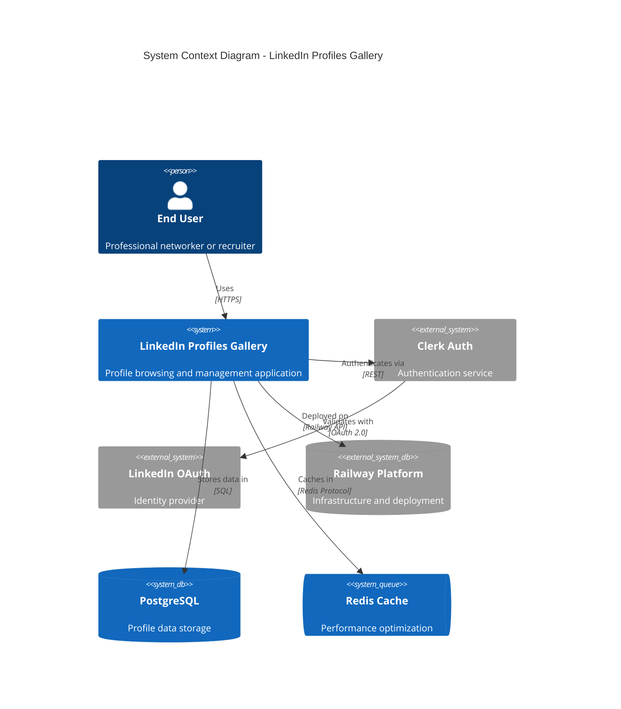

## 2.2 Component Details

### 2.2.1 Container Architecture

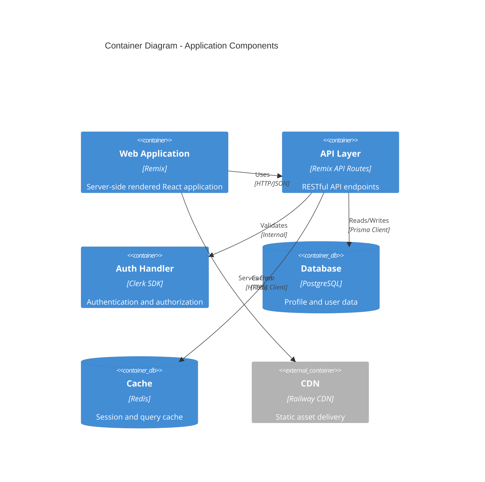

### 2.2.2 Component Specifications

| Component | Technology | Purpose | Scaling Strategy |
|-----------|------------|---------|------------------|
| Frontend | Remix + React | User interface rendering | Horizontal scaling |
| API Layer | Remix API Routes | Data access and business logic | Function isolation |
| Auth Service | Clerk SDK | User authentication | Managed service |
| Database | PostgreSQL 14+ | Data persistence | Vertical scaling |
| Cache Layer | Redis | Performance optimization | Memory scaling |
| CDN | Railway CDN | Static content delivery | Edge caching |

## 2.3 Technical Decisions

### 2.3.1 Architecture Patterns

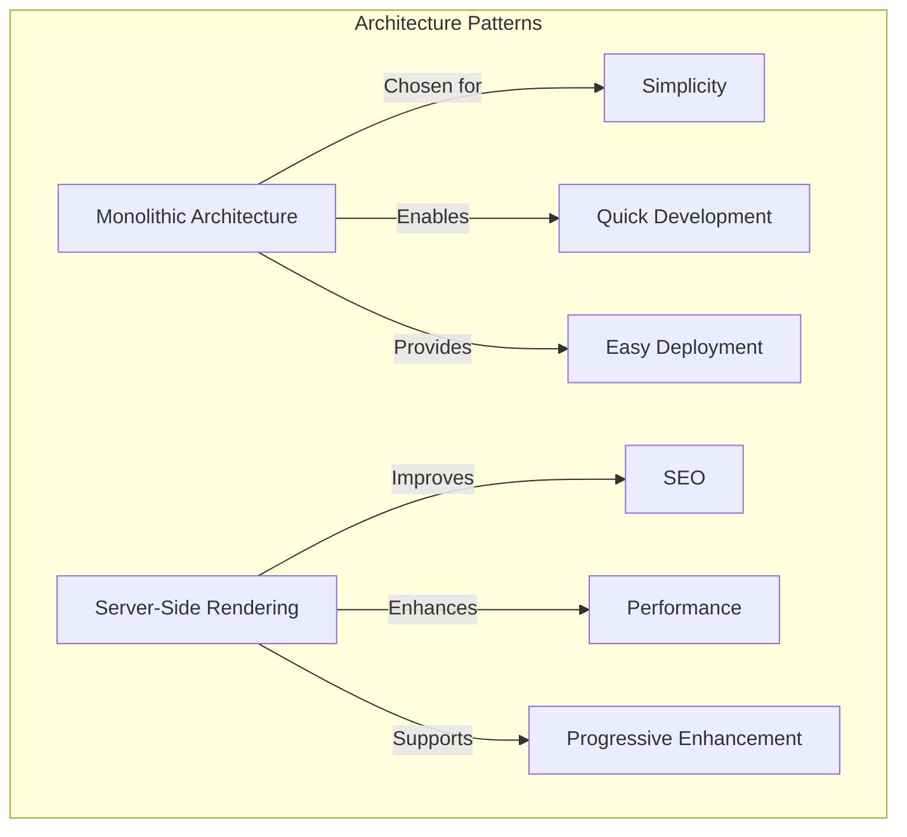

### 2.3.2 Communication Patterns

| Pattern | Implementation | Use Case |
|---------|---------------|-----------|
| Synchronous | REST APIs | Direct data operations |
| Server-Side | Remix loaders | Data fetching |
| Client-Side | Framer Motion | UI animations |
| Caching | Redis | Performance optimization |

## 2.4 Cross-Cutting Concerns

### 2.4.1 System Monitoring

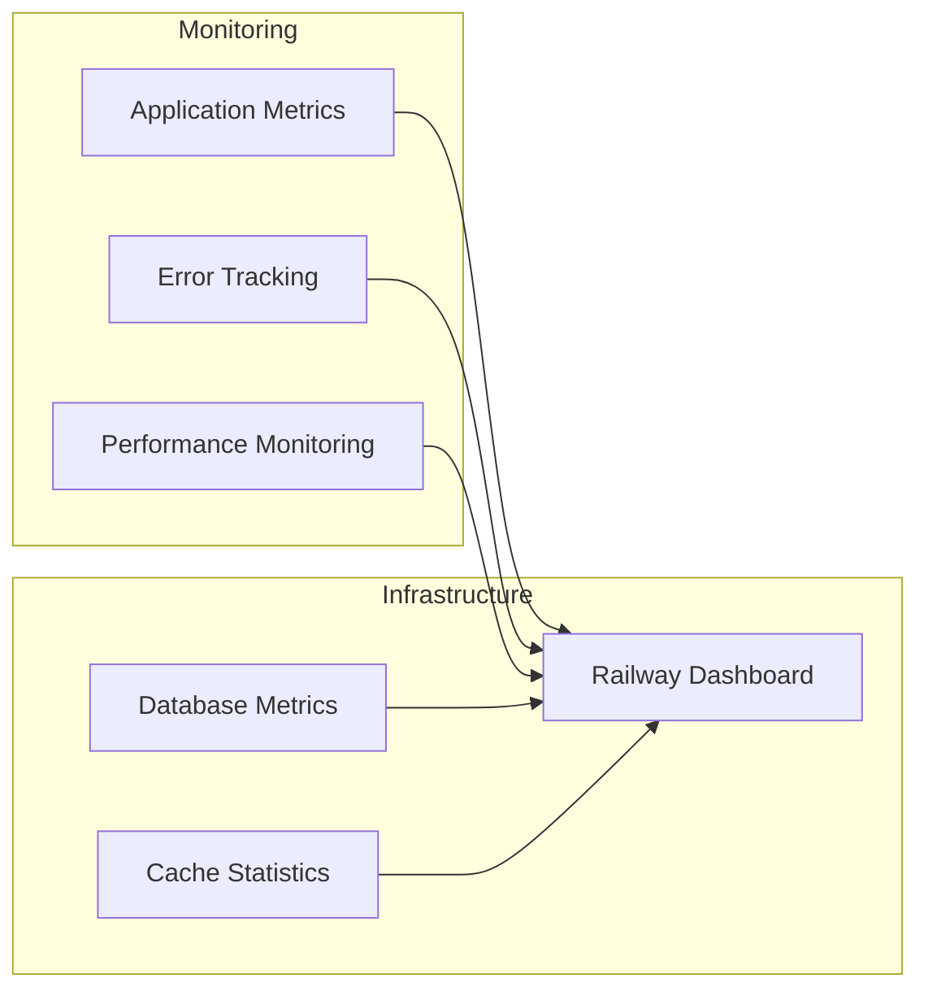

### 2.4.2 Security Architecture

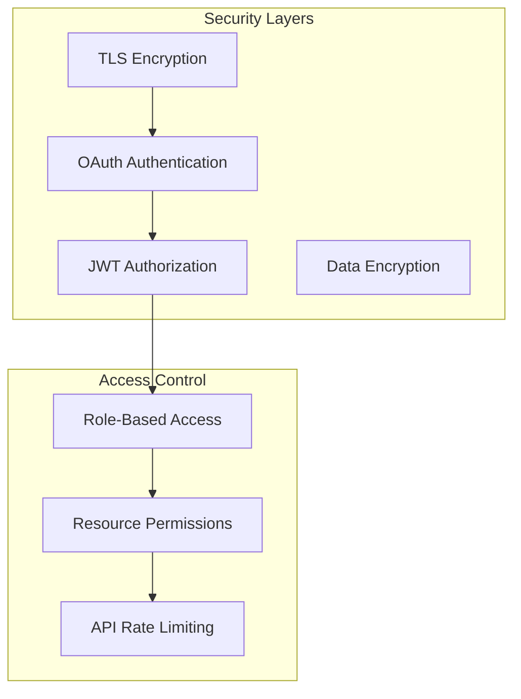

## 2.5 Deployment Architecture

```mermaid
C4Deployment
    title Deployment Diagram - Railway Infrastructure

    Deployment_Node(browser, "Client Browser", "Chrome, Firefox, Safari"){
        Container(spa, "Web Application", "React/Remix")
    }
    
    Deployment_Node(railway, "Railway Platform", "Production Environment"){
        Container(web, "Web Server", "Remix Server")
        Container(api, "API Server", "Remix API Routes")
        ContainerDb(db, "PostgreSQL", "Profile Database")
        ContainerDb(redis, "Redis", "Cache Layer")
    }
    
    Deployment_Node(ext, "External Services", "Third Party"){
        Container(clerk, "Clerk Auth")
        Container(linkedin, "LinkedIn OAuth")
    }
    
    Rel(browser, railway, "HTTPS")
    Rel(web, clerk, "REST/HTTPS")
    Rel(clerk, linkedin, "OAuth 2.0")
```

### 2.5.1 Infrastructure Requirements

| Component | Specification | Scaling Limits |
|-----------|--------------|----------------|
| Web Server | 1 CPU, 512MB RAM | 10 instances |
| Database | 2 CPU, 1GB RAM | 100GB storage |
| Redis Cache | 256MB RAM | 1GB memory |
| CDN | Edge locations | Unlimited |

### 2.5.2 Data Flow Architecture

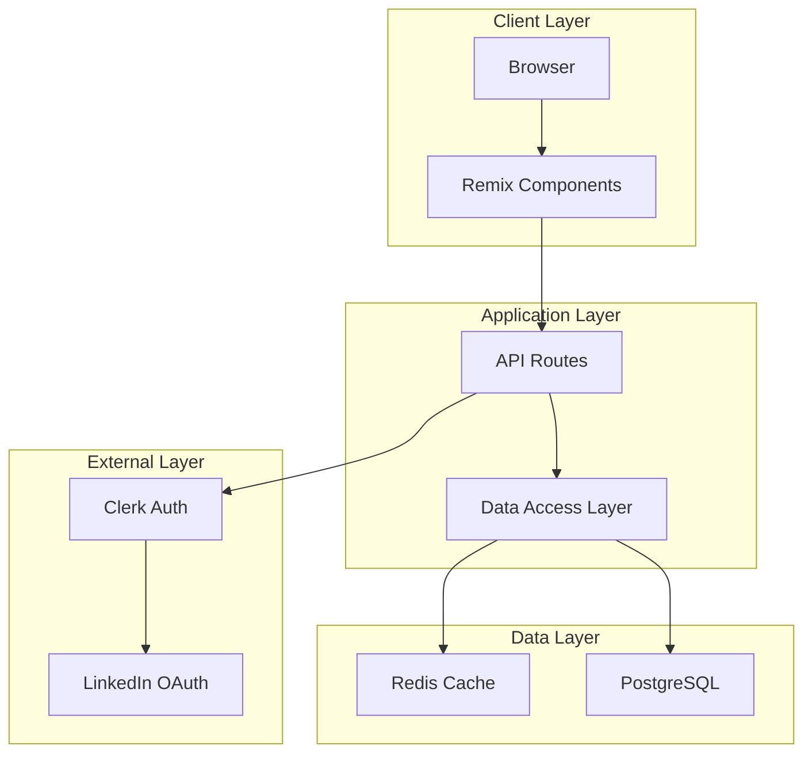

# 3. SYSTEM COMPONENTS ARCHITECTURE

## 3.1 USER INTERFACE DESIGN

### 3.1.1 Design Specifications

| Aspect | Requirement | Implementation |
|--------|-------------|----------------|
| Visual Hierarchy | Card-based layout with 3D effects | Framer Motion animations |
| Component Library | Custom Remix components | Tailwind CSS styling |
| Responsive Design | Mobile-first approach | Breakpoints: 640px, 768px, 1024px |
| Accessibility | WCAG 2.1 Level AA | ARIA labels, semantic HTML |
| Browser Support | Modern browsers | Chrome 90+, Firefox 88+, Safari 14+ |
| Theme Support | Light/Dark modes | CSS variables, Tailwind dark mode |
| Internationalization | English only (Phase 1) | i18n ready architecture |

### 3.1.2 Interface Elements

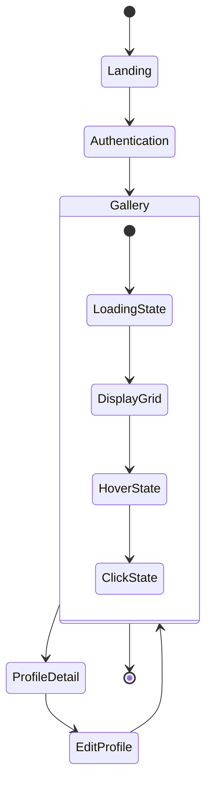

### 3.1.3 Critical User Flows

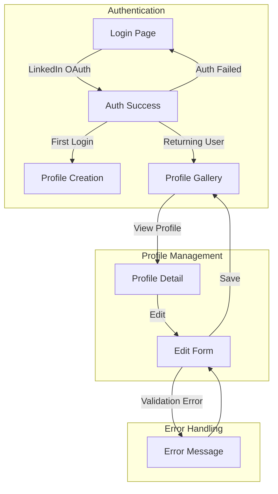

## 3.2 DATABASE DESIGN

### 3.2.1 Schema Design

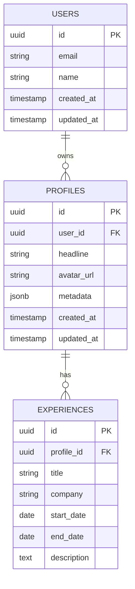

### 3.2.2 Data Management Strategy

| Component | Strategy | Implementation |
|-----------|----------|----------------|
| Migrations | Progressive | Prisma migrations |
| Versioning | Semantic versioning | Database schema versions |
| Archival | Soft deletes | Deleted_at timestamp |
| Retention | 90 days for inactive | Automated cleanup jobs |
| Privacy | Data encryption | Column-level encryption |
| Auditing | Change tracking | Audit log table |

### 3.2.3 Performance Optimization

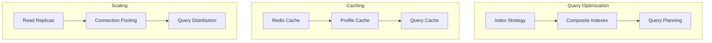

## 3.3 API DESIGN

### 3.3.1 API Architecture

| Component | Specification | Details |
|-----------|--------------|---------|
| Protocol | REST over HTTPS | TLS 1.3 |
| Authentication | JWT via Clerk | 24-hour expiration |
| Authorization | Role-based | User/Admin roles |
| Rate Limiting | 100 req/min | Per IP address |
| Versioning | URL-based | /api/v1/* |
| Documentation | OpenAPI 3.0 | Swagger UI |

### 3.3.2 API Endpoints

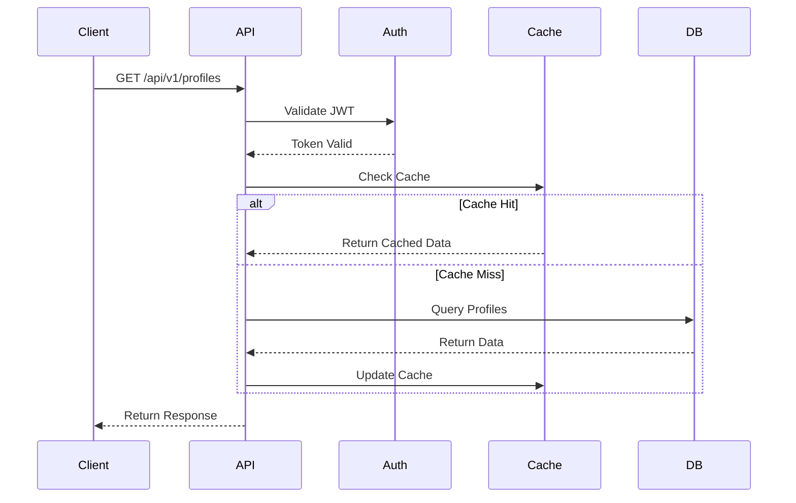

### 3.3.3 Integration Specifications

| Integration | Type | Authentication | Rate Limit |
|-------------|------|----------------|------------|
| LinkedIn OAuth | OAuth 2.0 | Client credentials | 10k/day |
| Clerk Auth | REST | API key | Unlimited |
| Railway API | REST | JWT | 1k/min |
| Redis Cache | TCP | Password | N/A |

### 3.3.4 Error Handling

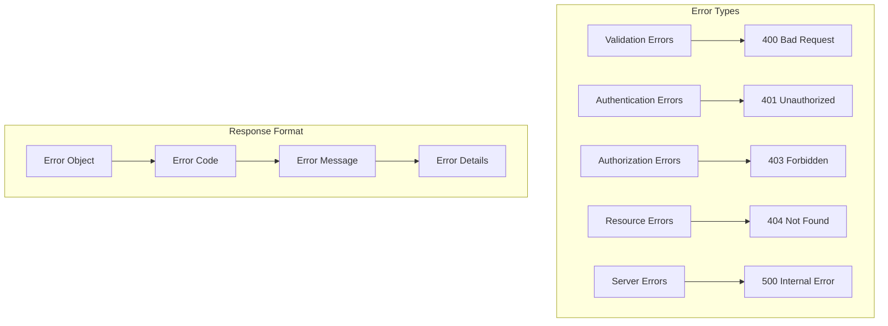

# 4. TECHNOLOGY STACK

## 4.1 PROGRAMMING LANGUAGES

| Platform | Language | Version | Justification |
|----------|----------|---------|---------------|
| Frontend | TypeScript | 4.9+ | Type safety, enhanced developer experience |
| Backend | Node.js | 18 LTS | JavaScript runtime for Remix framework |
| Database | SQL | PostgreSQL 14+ | Robust data integrity, Railway compatibility |
| Build Tools | JavaScript | ES2022 | Native build system support |

## 4.2 FRAMEWORKS & LIBRARIES

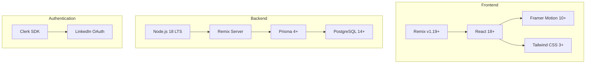

### Core Frameworks

| Framework | Version | Purpose | Justification |
|-----------|---------|---------|---------------|
| Remix | 1.19+ | Full-stack framework | Server-side rendering, optimal performance |
| React | 18+ | UI library | Component-based architecture |
| Prisma | 4+ | ORM | Type-safe database access |
| Framer Motion | 10+ | Animation library | Smooth profile card animations |
| Tailwind CSS | 3+ | Styling | Utility-first CSS, rapid development |

## 4.3 DATABASES & STORAGE

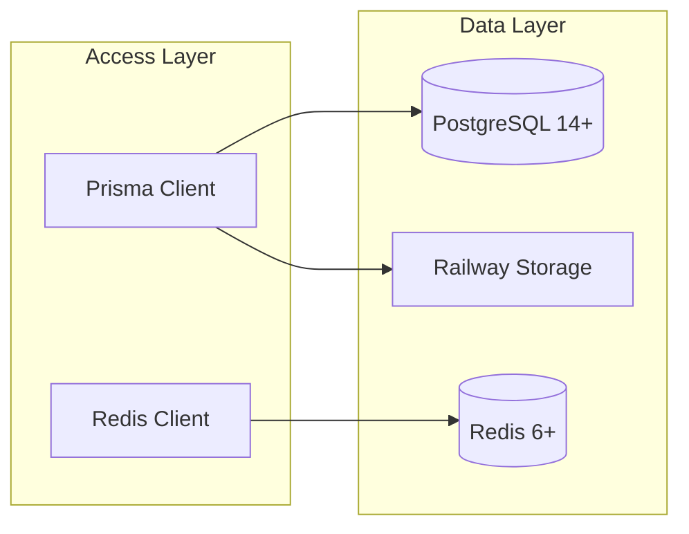

| Component | Technology | Purpose | Configuration |
|-----------|------------|---------|---------------|
| Primary Database | PostgreSQL 14+ | Profile data storage | Railway managed instance |
| Cache Layer | Redis 6+ | Session and query cache | 512MB instance |
| File Storage | Railway Storage | Profile images, assets | S3-compatible storage |
| ORM | Prisma Client | Database access layer | Type-safe queries |

## 4.4 THIRD-PARTY SERVICES

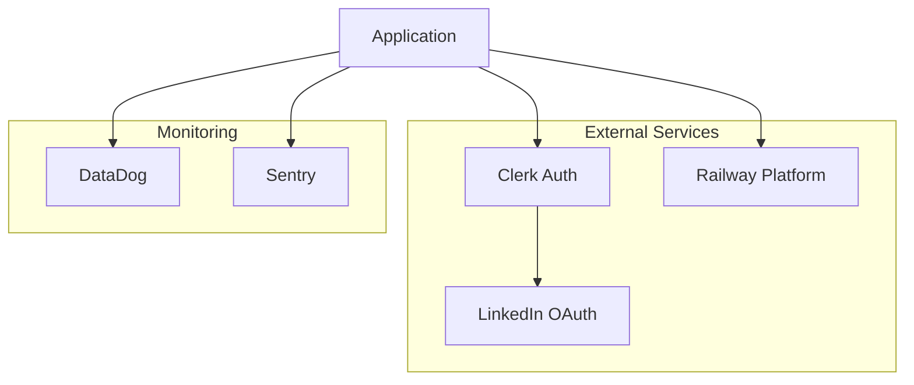

| Service | Purpose | Integration Method |
|---------|---------|-------------------|
| Clerk | Authentication | SDK integration |
| LinkedIn OAuth | Identity provider | OAuth 2.0 protocol |
| Railway | Infrastructure | Platform API |
| DataDog | Monitoring | Agent integration |
| Sentry | Error tracking | Client SDK |

## 4.5 DEVELOPMENT & DEPLOYMENT

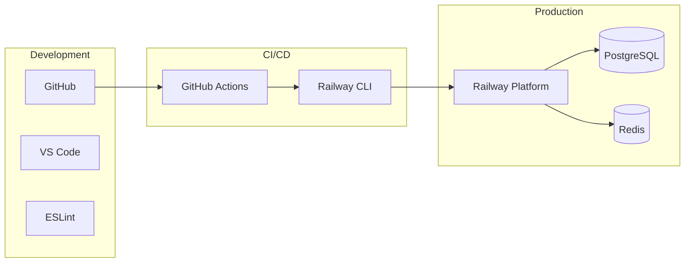

### Development Tools

| Tool | Version | Purpose |
|------|---------|---------|
| VS Code | Latest | Primary IDE |
| ESLint | 8+ | Code quality |
| Prettier | 2+ | Code formatting |
| Railway CLI | Latest | Deployment tool |

### Build & Deployment

| Stage | Tool | Configuration |
|-------|------|---------------|
| Source Control | GitHub | Main branch protection |
| CI/CD | GitHub Actions | Automated testing and deployment |
| Build | Node.js | Production optimization |
| Deployment | Railway | Automated deployment pipeline |

# 5. SYSTEM DESIGN

## 5.1 USER INTERFACE DESIGN

### 5.1.1 Layout Structure

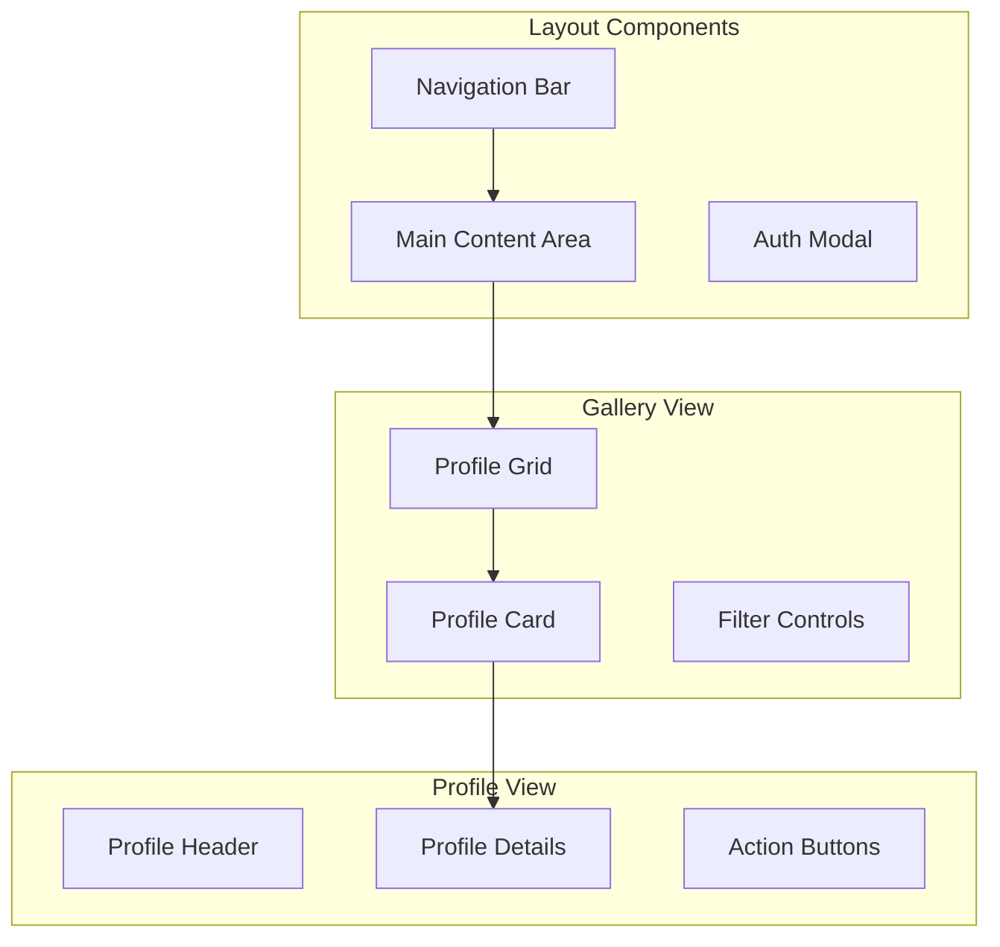

### 5.1.2 Component Specifications

| Component | Dimensions | Styling | Interactions |
|-----------|------------|---------|--------------|
| Profile Card | 320px × 400px | Tailwind shadow-lg | Hover animation |
| Gallery Grid | Responsive 3-column | Gap-4 grid | Infinite scroll |
| Navigation | Full width, 64px height | Sticky top-0 | Scroll hide/show |
| Auth Modal | 480px × auto | Centered overlay | Click outside close |

### 5.1.3 Animation States

```mermaid
stateDiagram-v2
    [*] --> Initial
    Initial --> Hover: Mouse Enter
    Hover --> Click: Mouse Click
    Click --> Expanded: Animation Complete
    Expanded --> Initial: Close
    Hover --> Initial: Mouse Leave
```

## 5.2 DATABASE DESIGN

### 5.2.1 Schema Design

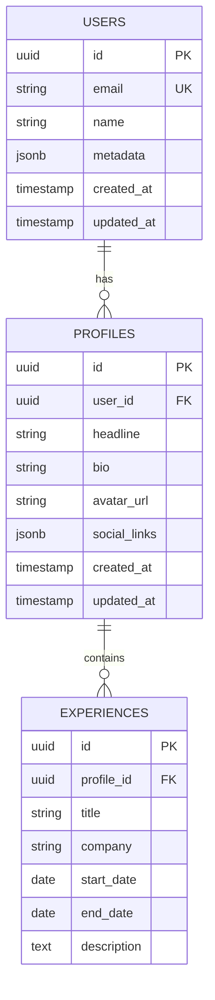

### 5.2.2 Indexing Strategy

| Table | Index | Type | Purpose |
|-------|-------|------|---------|
| users | email_idx | UNIQUE B-TREE | Email lookups |
| profiles | user_id_idx | B-TREE | Profile queries |
| profiles | created_at_idx | B-TREE | Timeline sorting |
| experiences | profile_id_date_idx | COMPOSITE | Experience filtering |

### 5.2.3 Data Access Patterns

```mermaid
flowchart LR
    subgraph Access Layers
        API[API Layer]
        Cache[Redis Cache]
        DB[(PostgreSQL)]
    end

    subgraph Query Patterns
        Read[Read Operations]
        Write[Write Operations]
        Update[Update Operations]
    end

    Read --> Cache
    Cache --> DB
    Write --> DB
    Update --> Cache
    Update --> DB
```

## 5.3 API DESIGN

### 5.3.1 REST Endpoints

| Endpoint | Method | Purpose | Response |
|----------|--------|---------|-----------|
| /api/profiles | GET | List profiles | Profile[] |
| /api/profiles/:id | GET | Get profile | Profile |
| /api/profiles | POST | Create profile | Profile |
| /api/profiles/:id | PUT | Update profile | Profile |
| /api/experiences | POST | Add experience | Experience |

### 5.3.2 Request/Response Flow

```mermaid
sequenceDiagram
    participant Client
    participant API
    participant Auth
    participant Cache
    participant DB

    Client->>API: Request Profile
    API->>Auth: Validate Token
    Auth-->>API: Token Valid
    API->>Cache: Check Cache
    alt Cache Hit
        Cache-->>API: Return Data
    else Cache Miss
        API->>DB: Query Data
        DB-->>API: Return Data
        API->>Cache: Update Cache
    end
    API-->>Client: Send Response
```

### 5.3.3 Error Handling

| Status Code | Scenario | Response Format |
|-------------|----------|-----------------|
| 400 | Invalid request | {error: string, details: object} |
| 401 | Unauthorized | {error: string, redirect: string} |
| 403 | Forbidden | {error: string, required_role: string} |
| 404 | Not found | {error: string, resource: string} |
| 500 | Server error | {error: string, reference: string} |

### 5.3.4 Rate Limiting

```mermaid
flowchart TD
    subgraph Rate Limiting
        Check[Check Limit]
        Allow[Allow Request]
        Block[Block Request]
        Update[Update Counter]
    end

    Check -->|Under Limit| Allow
    Check -->|Over Limit| Block
    Allow --> Update
```

| Tier | Rate Limit | Window | Burst |
|------|------------|--------|--------|
| Anonymous | 60 | 1 minute | 5 |
| Authenticated | 1000 | 1 minute | 50 |
| Admin | 5000 | 1 minute | 200 |

# 6. USER INTERFACE DESIGN

## 6.1 Interface Components Key

| Symbol | Meaning |
|--------|---------|
| [@] | User/Profile icon |
| [#] | Menu/Dashboard |
| [+] | Add/Create action |
| [x] | Close/Delete |
| [<][>] | Navigation arrows |
| [=] | Settings menu |
| [...] | Text input field |
| [v] | Dropdown menu |
| [ ] | Checkbox |
| [!] | Alert/Warning |
| [^] | Upload function |
| [*] | Favorite/Important |

## 6.2 Main Navigation Layout

```
+----------------------------------------------------------+
|  [@] Profile    [#] Gallery    [=] Settings    [?] Help   |
+----------------------------------------------------------+
```

## 6.3 Profile Gallery View

```
+----------------------------------------------------------+
| Search: [...........................] [v] Filter  [+] Add  |
+----------------------------------------------------------+
|                                                           |
|  +-------------+  +-------------+  +-------------+        |
|  |    [@]     |  |    [@]     |  |    [@]     |        |
|  | John Doe   |  | Jane Smith  |  | Bob Wilson |        |
|  | Developer  |  | Designer    |  | Manager    |        |
|  | [*] [!]    |  | [*]        |  |            |        |
|  +-------------+  +-------------+  +-------------+        |
|                                                           |
|  +-------------+  +-------------+  +-------------+        |
|  |    [@]     |  |    [@]     |  |    [@]     |        |
|  | Amy Lee    |  | Mark Brown  |  | Sara Jones |        |
|  | Engineer   |  | Architect   |  | Lead Dev   |        |
|  |            |  | [!]         |  | [*]        |        |
|  +-------------+  +-------------+  +-------------+        |
|                                                           |
|  [<] 1 2 3 ... 10 [>]                                    |
+----------------------------------------------------------+
```

## 6.4 Profile Detail View

```
+----------------------------------------------------------+
|  [x] Close                                     [=] Edit    |
+----------------------------------------------------------+
|                                                           |
|     +------------------------------------------+         |
|     |                [@]                        |         |
|     |            Profile Picture                |         |
|     |          [^] Update Photo                |         |
|     +------------------------------------------+         |
|                                                           |
|     Name: John Doe                                       |
|     Title: Senior Software Developer                     |
|     Location: San Francisco, CA                          |
|                                                           |
|     Experience:                                          |
|     +------------------------------------------+         |
|     | Current: Tech Lead @ Company XYZ         |         |
|     | 2020-Present                            |         |
|     +------------------------------------------+         |
|     +------------------------------------------+         |
|     | Previous: Developer @ Company ABC        |         |
|     | 2018-2020                               |         |
|     +------------------------------------------+         |
|                                                           |
|     [*] Favorite  [!] Report  [@] Connect               |
+----------------------------------------------------------+
```

## 6.5 Profile Edit Form

```
+----------------------------------------------------------+
|  [x] Cancel                                 [Save] [Delete]|
+----------------------------------------------------------+
|                                                           |
|  Personal Information:                                    |
|  +--------------------------------------------------+   |
|  | Name:     [..................................]    |   |
|  | Title:    [..................................]    |   |
|  | Location: [..................................]    |   |
|  +--------------------------------------------------+   |
|                                                           |
|  Experience:                                             |
|  +--------------------------------------------------+   |
|  | Company:  [..................................]    |   |
|  | Position: [..................................]    |   |
|  | Duration: [.........] to [.........] [ ] Present |   |
|  | Description:                                      |   |
|  | [...................................]            |   |
|  | [...................................]            |   |
|  +--------------------------------------------------+   |
|  [+] Add Another Experience                             |
|                                                           |
|  Privacy Settings:                                       |
|  [ ] Make profile public                                 |
|  [ ] Allow connection requests                           |
|  [ ] Show experience details                             |
+----------------------------------------------------------+
```

## 6.6 Mobile Responsive Layout

```
+----------------------+
| [#] LinkedIn Gallery |
+----------------------+
| [@] Profile  [=] Menu|
+----------------------+
|     +------------+   |
|     |    [@]    |   |
|     | John Doe  |   |
|     | Developer |   |
|     | [*]       |   |
|     +------------+   |
|                      |
|     +------------+   |
|     |    [@]    |   |
|     | Jane Smith|   |
|     | Designer  |   |
|     |          |   |
|     +------------+   |
|                      |
| [<] 1 2 3 [>]       |
+----------------------+
```

## 6.7 Animation States

```mermaid
stateDiagram-v2
    [*] --> Normal
    Normal --> Hover: Mouse Enter
    Hover --> Expanded: Click
    Expanded --> Normal: Close
    Hover --> Normal: Mouse Leave
    Normal --> Loading: Data Fetch
    Loading --> Normal: Data Loaded
```

## 6.8 Responsive Breakpoints

| Breakpoint | Layout Changes |
|------------|---------------|
| Desktop (≥1024px) | 3-column grid, full navigation |
| Tablet (≥768px) | 2-column grid, condensed navigation |
| Mobile (<768px) | Single column, hamburger menu |

## 6.9 Component Interactions

| Component | Interaction | Animation |
|-----------|------------|-----------|
| Profile Card | Hover | 3D rotation with Framer Motion |
| Gallery Grid | Scroll | Lazy loading with fade-in |
| Navigation | Click | Smooth transitions |
| Forms | Submit | Loading state animation |
| Modals | Open/Close | Scale and fade effects |

# 7. SECURITY CONSIDERATIONS

## 7.1 AUTHENTICATION AND AUTHORIZATION

| Security Layer | Implementation | Details |
|----------------|----------------|----------|
| Primary Authentication | Clerk with LinkedIn OAuth | Multi-factor authentication support |
| Session Management | JWT tokens | 24-hour expiration, secure cookie storage |
| Authorization Model | Role-based access control | User and Admin role separation |
| Rate Limiting | IP-based throttling | 100 requests per minute per IP |
| Failed Login Protection | Progressive delays | Exponential backoff after 3 failed attempts |

```mermaid
flowchart TD
    A[User Access Request] --> B{Has Session?}
    B -->|No| C[Clerk Authentication]
    C --> D{LinkedIn OAuth}
    D -->|Success| E[Generate JWT]
    D -->|Failure| F[Error Response]
    B -->|Yes| G{Validate Token}
    G -->|Valid| H[Check Permissions]
    G -->|Invalid| C
    H -->|Authorized| I[Grant Access]
    H -->|Unauthorized| J[Access Denied]
```

## 7.2 DATA SECURITY

### 7.2.1 Data Protection Measures

| Data Type | Protection Method | Implementation |
|-----------|------------------|----------------|
| PII Data | Column-level encryption | AES-256 encryption |
| Passwords | Not stored | Managed by Clerk |
| API Keys | Environment variables | Railway secrets management |
| Session Data | Redis encryption | TLS-encrypted cache |
| Database Backups | Encrypted storage | Railway backup encryption |

### 7.2.2 Data Access Controls

```mermaid
flowchart LR
    subgraph Access Layers
        L1[Application Layer]
        L2[API Layer]
        L3[Database Layer]
    end
    
    subgraph Security Controls
        S1[JWT Validation]
        S2[Role Verification]
        S3[Row-Level Security]
    end
    
    L1 --> S1
    S1 --> L2
    L2 --> S2
    S2 --> L3
    L3 --> S3
```

## 7.3 SECURITY PROTOCOLS

### 7.3.1 Network Security

| Protocol | Implementation | Purpose |
|----------|----------------|---------|
| TLS 1.3 | Railway SSL | In-transit encryption |
| HTTPS | Forced SSL | Secure communication |
| CORS | Restricted origins | Cross-origin protection |
| CSP | Content Security Policy | XSS prevention |
| HSTS | Strict Transport Security | Force HTTPS usage |

### 7.3.2 Security Monitoring

```mermaid
flowchart TD
    subgraph Detection
        A[Security Events]
        B[Access Logs]
        C[Error Monitoring]
    end
    
    subgraph Analysis
        D[Pattern Detection]
        E[Threat Assessment]
        F[Anomaly Detection]
    end
    
    subgraph Response
        G[Alert Generation]
        H[Automatic Blocking]
        I[Incident Logging]
    end
    
    A --> D
    B --> D
    C --> D
    D --> E
    E --> G
    E --> H
    G --> I
    H --> I
```

### 7.3.3 Security Compliance Measures

| Requirement | Implementation | Verification |
|-------------|----------------|--------------|
| GDPR Compliance | Data minimization, consent management | Regular audits |
| OWASP Top 10 | Security controls implementation | Automated scanning |
| OAuth 2.0 | LinkedIn OAuth integration | OAuth specification compliance |
| Data Protection | Encryption at rest and in transit | Security testing |
| Access Control | Role-based permissions | Permission matrix validation |

### 7.3.4 Incident Response Plan

```mermaid
stateDiagram-v2
    [*] --> Detection
    Detection --> Analysis
    Analysis --> Containment
    Containment --> Eradication
    Eradication --> Recovery
    Recovery --> PostIncident
    PostIncident --> [*]
    
    state Detection {
        [*] --> AlertTriggered
        AlertTriggered --> IncidentLogged
    }
    
    state Response {
        Containment --> IsolateSystem
        IsolateSystem --> BlockAccess
    }
```

### 7.3.5 Security Update Management

| Component | Update Strategy | Frequency |
|-----------|----------------|-----------|
| Dependencies | Automated security updates | Weekly |
| System Packages | Scheduled updates | Monthly |
| Security Patches | Emergency updates | As needed |
| SSL Certificates | Automatic renewal | 30 days before expiry |
| Security Policies | Regular review | Quarterly |

# 8. INFRASTRUCTURE

## 8.1 DEPLOYMENT ENVIRONMENT

| Environment | Provider | Purpose | Configuration |
|------------|----------|---------|---------------|
| Development | Local/Railway | Development and testing | Single instance, development database |
| Staging | Railway | Pre-production testing | Production-like environment |
| Production | Railway | Live application hosting | High-availability configuration |

```mermaid
flowchart TD
    subgraph Development
        Dev[Local Development]
        DevDB[(Dev Database)]
    end
    
    subgraph Staging
        Stage[Staging Server]
        StageDB[(Staging Database)]
        StageCache[(Redis Cache)]
    end
    
    subgraph Production
        Prod[Production Server]
        ProdDB[(Production Database)]
        ProdCache[(Redis Cache)]
        CDN[Railway CDN]
    end
    
    Dev -->|Deploy| Stage
    Stage -->|Promote| Prod
    Prod --> CDN
```

## 8.2 CLOUD SERVICES

| Service | Provider | Purpose | Specifications |
|---------|----------|---------|----------------|
| Application Hosting | Railway | Primary application platform | Autoscaling enabled, 512MB RAM minimum |
| Database | Railway PostgreSQL | Profile data storage | Dedicated instance, 1GB RAM |
| Caching | Railway Redis | Performance optimization | 256MB instance |
| CDN | Railway CDN | Static asset delivery | Global edge locations |
| Authentication | Clerk | User authentication | OAuth integration |

```mermaid
flowchart LR
    subgraph Railway Platform
        App[Application Server]
        DB[(PostgreSQL)]
        Cache[(Redis)]
        CDN[CDN]
    end
    
    subgraph External Services
        Clerk[Clerk Auth]
        LinkedIn[LinkedIn OAuth]
    end
    
    Client[Client Browser] --> CDN
    Client --> App
    App --> DB
    App --> Cache
    App --> Clerk
    Clerk --> LinkedIn
```

## 8.3 CONTAINERIZATION

### Container Architecture

```mermaid
flowchart TD
    subgraph Container Components
        App[Application Container]
        DB[(Database Container)]
        Cache[(Cache Container)]
    end
    
    subgraph Shared Resources
        Config[Configuration]
        Secrets[Secret Management]
        Storage[Persistent Storage]
    end
    
    App --> Config
    App --> Secrets
    DB --> Storage
    DB --> Secrets
    Cache --> Config
```

| Component | Base Image | Resource Limits |
|-----------|------------|-----------------|
| Application | node:18-alpine | CPU: 1 core, Memory: 512MB |
| PostgreSQL | postgres:14-alpine | CPU: 2 cores, Memory: 1GB |
| Redis | redis:6-alpine | CPU: 0.5 core, Memory: 256MB |

## 8.4 ORCHESTRATION

Railway handles container orchestration automatically, providing:

| Feature | Implementation | Configuration |
|---------|----------------|---------------|
| Load Balancing | Railway Edge Network | Automatic distribution |
| Health Checks | HTTP endpoint monitoring | 30-second intervals |
| Auto-scaling | Resource-based scaling | 1-10 instances |
| Service Discovery | Internal DNS resolution | Automatic routing |

```mermaid
graph TD
    A-->B
```

## 8.5 CI/CD PIPELINE

### Pipeline Architecture

```mermaid
flowchart LR
    subgraph Source
        GH[GitHub Repository]
    end
    
    subgraph CI Process
        Test[Run Tests]
        Build[Build Container]
        Scan[Security Scan]
    end
    
    subgraph CD Process
        Deploy[Deploy to Railway]
        Monitor[Health Check]
        Rollback[Automatic Rollback]
    end
    
    GH --> Test
    Test --> Build
    Build --> Scan
    Scan --> Deploy
    Deploy --> Monitor
    Monitor -->|Failure| Rollback
```

### Pipeline Stages

| Stage | Tools | Actions | Success Criteria |
|-------|-------|---------|------------------|
| Source Control | GitHub | Code push, PR creation | Branch protection rules |
| Testing | Jest, Cypress | Unit tests, E2E tests | 100% pass rate |
| Build | Docker | Container creation | Successful build |
| Security | Snyk, SonarQube | Vulnerability scanning | No critical issues |
| Deployment | Railway CLI | Production deployment | Health check pass |
| Monitoring | Railway Metrics | Performance tracking | No alerts triggered |

### Deployment Configuration

| Environment | Trigger | Strategy | Rollback |
|-------------|---------|----------|-----------|
| Development | Push to dev | Direct deployment | Manual |
| Staging | PR to main | Blue-green deployment | Automatic |
| Production | Release tag | Progressive rollout | Automatic |

# 8. APPENDICES

## 8.1 GLOSSARY

| Term | Definition |
|------|------------|
| Railway | Cloud platform for deploying and hosting web applications with integrated PostgreSQL support |
| Clerk | Authentication and user management service with OAuth provider integrations |
| Framer Motion | Production-ready motion library for React providing animation capabilities |
| Remix | Full-stack web framework built on React with server-side rendering capabilities |
| Prisma | Next-generation ORM for Node.js and TypeScript |
| Redis | In-memory data structure store used as cache and message broker |
| Tailwind CSS | Utility-first CSS framework for rapid UI development |
| PostgreSQL | Open-source relational database management system |

## 8.2 ACRONYMS

| Acronym | Full Form |
|---------|-----------|
| API | Application Programming Interface |
| CDN | Content Delivery Network |
| CI/CD | Continuous Integration/Continuous Deployment |
| CORS | Cross-Origin Resource Sharing |
| CSP | Content Security Policy |
| CRUD | Create, Read, Update, Delete |
| GDPR | General Data Protection Regulation |
| HSTS | HTTP Strict Transport Security |
| JWT | JSON Web Token |
| MFA | Multi-Factor Authentication |
| ORM | Object-Relational Mapping |
| PII | Personally Identifiable Information |
| REST | Representational State Transfer |
| SSL | Secure Sockets Layer |
| TLS | Transport Layer Security |
| UI | User Interface |
| WAL | Write-Ahead Logging |
| XSS | Cross-Site Scripting |

## 8.3 DEVELOPMENT ENVIRONMENT SETUP

```mermaid
flowchart TD
    A[Install Node.js] --> B[Create Remix Project]
    B --> C[Install Dependencies]
    C --> D[Configure Environment]
    D --> E[Initialize Database]
    E --> F[Setup Authentication]
    
    subgraph Dependencies
        G[Clerk SDK]
        H[Framer Motion]
        I[Prisma Client]
        J[Tailwind CSS]
    end
    
    C --> Dependencies
```

## 8.4 CONFIGURATION REFERENCE

| Component | Configuration File | Purpose |
|-----------|-------------------|---------|
| Remix | remix.config.js | Framework configuration |
| Prisma | schema.prisma | Database schema and client config |
| Tailwind | tailwind.config.js | CSS utility configuration |
| ESLint | .eslintrc.js | Code style enforcement |
| Railway | railway.json | Deployment configuration |
| TypeScript | tsconfig.json | TypeScript compiler options |

## 8.5 ERROR CODES AND HANDLING

```mermaid
flowchart LR
    subgraph Error Categories
        A[Authentication Errors]
        B[Validation Errors]
        C[Database Errors]
        D[Network Errors]
    end
    
    subgraph Response Codes
        E[4xx Client Errors]
        F[5xx Server Errors]
    end
    
    A --> E
    B --> E
    C --> F
    D --> F
```

## 8.6 PERFORMANCE OPTIMIZATION CHECKLIST

| Category | Optimization | Implementation |
|----------|--------------|----------------|
| Caching | Redis Implementation | Profile data caching |
| Database | Index Optimization | Composite indexes on frequently queried fields |
| Frontend | Code Splitting | Dynamic imports for route-based code splitting |
| Images | CDN Integration | Railway CDN for static assets |
| API | Response Compression | gzip/brotli compression |
| Security | Rate Limiting | Request throttling per IP |

## 8.7 MONITORING AND LOGGING

```mermaid
flowchart TD
    subgraph Monitoring
        A[Application Metrics]
        B[Error Tracking]
        C[Performance Monitoring]
    end
    
    subgraph Logging
        D[Application Logs]
        E[Access Logs]
        F[Security Logs]
    end
    
    subgraph Storage
        G[Railway Logs]
        H[Database Logs]
    end
    
    A & B & C --> G
    D & E & F --> H
```

## 8.8 BACKUP AND RECOVERY PROCEDURES

| Procedure | Frequency | Retention | Method |
|-----------|-----------|-----------|---------|
| Full Database Backup | Daily | 7 days | Railway automated backup |
| Transaction Logs | Continuous | 24 hours | WAL archiving |
| Configuration Backup | Weekly | 30 days | Git repository |
| User Data Export | On demand | Immediate | API endpoint |